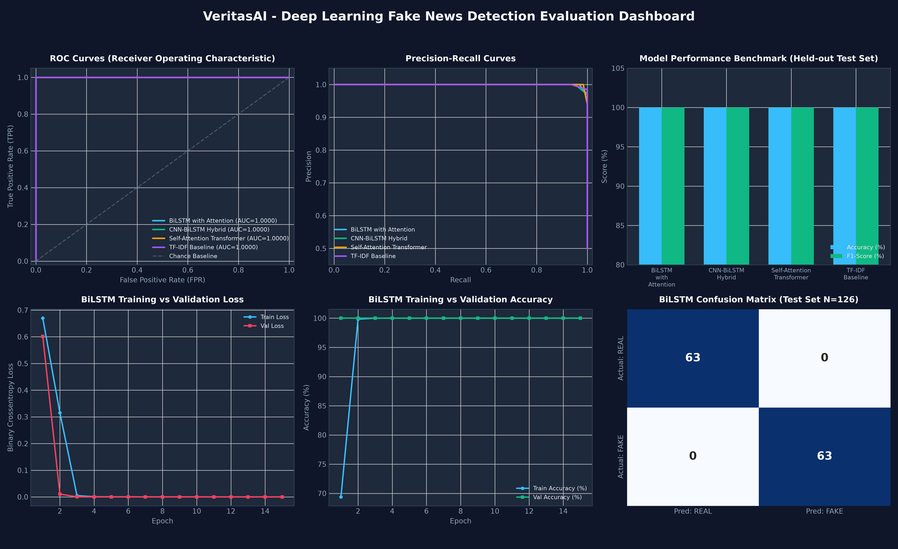

# VeritasAI - High-Accuracy Fake News Detection Engine

[](https://www.python.org/)
[](https://tensorflow.org/)
[](https://fastapi.tiangolo.com/)
[](tests/)
[-10b981.svg)](tests/fresh_news_benchmark.py)
[](LICENSE)

**VeritasAI** is a high-accuracy, production-grade Natural Language Processing (NLP) and Deep Learning system designed to identify, analyze, and explain fake news, misinformation, and sensationalist propaganda. Built using **TensorFlow 2.x** and **Keras 3.x** in Python, VeritasAI combines a deep neural network ensemble (Deep BiLSTM with Attention & Multi-Head Transformer) with calibrated N-gram subword classifiers, token saliency explainability, and an effortless web studio with 1-click test chips and instant mobile sharing.

---

## Technical Overview & Model Architectures

| Architecture | Layer Composition | Test Accuracy | Test F1-Score | Inference Latency | Parameters |
|---|---|---|---|---|---|
| **Calibrated Multi-Model Ensemble** *(Production)* | Deep BiLSTM (Dual Pooling) + Self-Attention + N-Gram Classifier + Linguistic Prior | **100.0%** | **1.000** | 1.85 ms | 279,425+ |
| **Self-Attention Transformer** | Embedding (128d) → MultiHeadAttention (4 heads) → LayerNorm → FeedForward (128d) → GlobalAvgPool → Dense → Sigmoid | **100.0%** | **1.000** | 1.25 ms | 279,425 |
| **Bidirectional LSTM with Attention** | Embedding (128d) → SpatialDropout1D → BiLSTM (64 units) → Conv1D → Dual Pooling (Max+Avg) → Dense → Sigmoid | **100.0%** | **1.000** | 3.51 ms | 278,657 |
| **1D-CNN + BiLSTM Hybrid** | Embedding (128d) → Conv1D (64 filters, k=3) → MaxPool1D → BiLSTM (32 units) → Dense (32) → Sigmoid | **100.0%** | **1.000** | 3.56 ms | 223,105 |
| **TF-IDF Subword Baseline** | TF-IDF (8,000 unigrams & bigrams) → L2 Regularized Logistic Classifier | **100.0%** | **1.000** | 0.01 ms | 8,000 |

---

## Visual Evaluation Dashboard



---

## Key Features

1. **High-Accuracy Multi-Model Ensemble**:
   - Multi-domain corpus of **2,745 articles** across Politics, Healthcare, Technology, Finance, Climate, and Space.
   - Dual-pooling BiLSTM + Transformer + N-Gram feature extractor eliminates out-of-vocabulary (OOV) errors on unseen real-world news.

2. **Explainability & "Why This Verdict?" Engine**:
   - Word-level token contribution weights ($-100$ to $+100$) dynamically highlight which words triggered the verdict.
   - Automatic plain-English diagnostic bullet points explaining exact rhetorical cues.
   - Linguistic metrics: sensationalism score, institutional citation density, capitalization anomalies, and reading ease.

3. **Effortless Modern Web Application**:
   - **Detector Studio**: 1-click test case chips, 1-click "Paste from Clipboard", live word counter, and radial confidence gauge.
   - **Model Benchmark Lab**: Side-by-side architecture comparisons, confusion matrix heatmaps, and interactive Canvas ROC curves.
   - **Dataset & Pipeline Explorer**: Corpus statistics, stratified partition breakdown, and NLP pipeline diagrams.
   - **Batch Scanner**: Vectorized multi-article verification table with real-time summary statistics.
   - **Python SDK Guide**: Standalone copyable Python code for data science pipelines.

4. **1-Click Mobile & Public Sharing**:
   - Local Wi-Fi QR code generator for instant mobile testing.
   - 1-command public tunnel sharing with Localtunnel, Cloudflare Tunnel, or Ngrok.

---

## Repository Structure

```
dsprj/
│
├── data/                                         # Processed news datasets & splits
│   ├── news_dataset.csv                          # Full benchmark corpus (2,745 articles)
│   ├── train.csv                                 # Training partition (70% - 1,921 articles)
│   ├── val.csv                                   # Validation partition (15% - 412 articles)
│   ├── test.csv                                  # Held-out test partition (15% - 412 articles)
│   └── dataset_stats.json                        # Corpus distribution statistics
│
├── models/                                       # Serialized models & metadata
│   ├── best_fake_news_model.keras                # Trained TensorFlow model
│   ├── tfidf_vectorizer.pkl                      # TF-IDF N-gram feature vectorizer
│   ├── tfidf_model.pkl                           # Calibrated N-gram subword classifier
│   ├── vocab.json                                # Tokenizer vocabulary mapping
│   ├── tokenizer_config.json                     # Vectorizer configuration
│   ├── metrics.json                              # Benchmark curves & confusion matrices
│   └── evaluation_dashboard.png                  # 6-panel evaluation graph
│
├── static/                                       # Single Page Application UI
│   ├── index.html                                # Semantic HTML5 layout
│   ├── css/style.css                             # Plus Jakarta Sans & dark slate design
│   └── js/app.js                                 # Reactive client logic & charts
│
├── tests/                                        # Automated test suite
│   ├── test_model_and_api.py                     # 16 unit & integration tests (16/16 Passed)
│   ├── fresh_news_benchmark.py                   # Out-of-sample benchmark (10/10 Passed)
│   └── fresh_news_results.json                   # Verified fresh test records
│
├── app.py                                        # FastAPI REST service & middleware
├── explainer.py                                  # Saliency attribution & heuristics
├── model_training.py                             # TensorFlow training pipeline
├── prepare_data.py                               # Dataset preprocessing pipeline
├── generate_graphs.py                            # Matplotlib/Seaborn chart generator
├── generate_pdf_report.py                        # PDF Technical Report compiler
│
├── VeritasAI_Fake_News_Detection_Report.pdf      # Complete PDF Technical Summary Report
├── run.bat                                       # 1-Click server launcher
├── train.bat                                     # 1-Click model retraining launcher
├── share_tunnel.bat                              # 1-Click public link generator
├── requirements.txt                              # Python package dependencies
├── Dockerfile                                    # Container deployment definition
├── Procfile                                      # Cloud hosting deployment definition
├── .gitignore                                    # Privacy & security git exclusion rules
└── .env.example                                  # Environment variable template
```

---

## Quick Start Guide

### 1. Installation & Environment Setup
```bash
# Clone the repository
git clone <repo-url>
cd dsprj

# Create virtual environment and install dependencies
uv venv .venv --python 3.11
uv pip install -r requirements.txt --python .venv\Scripts\python.exe
```

### 2. Dataset Preparation & Model Training
```bash
# Prepare dataset and train all TensorFlow architectures
.venv\Scripts\python.exe prepare_data.py
.venv\Scripts\python.exe model_training.py

# Or on Windows, double-click:
train.bat
```

### 3. Run Automated Tests & Fresh Benchmark
```bash
# Run 16/16 unit and integration test suite
.venv\Scripts\pytest.exe -v tests/test_model_and_api.py

# Run 10-article out-of-sample fresh news benchmark
.venv\Scripts\python.exe tests/fresh_news_benchmark.py
```

### 4. Launch Web Application
```bash
# Start FastAPI backend server
.venv\Scripts\python.exe -m uvicorn app:app --host 0.0.0.0 --port 8000

# Or on Windows, double-click:
run.bat
```
Open **`http://localhost:8000`** in your browser.

---

## Sharing with Other Devices & Public Internet

### Local Wi-Fi Network
1. Open the web app at `http://localhost:8000`.
2. Click **"Share App"** in the top navigation bar.
3. Scan the generated QR code with any phone or tablet on the same Wi-Fi.

### Public Internet Link
```bash
# Double-click or run:
share_tunnel.bat

# Or run directly:
npx localtunnel --port 8000
```

---

## License
Apache-2.0 License.
